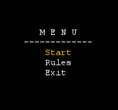
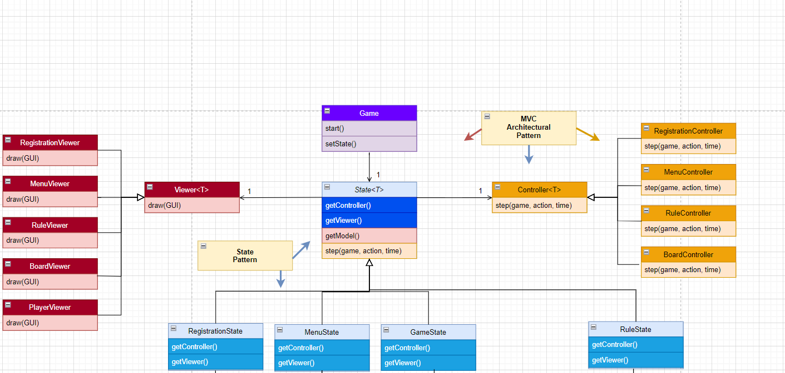
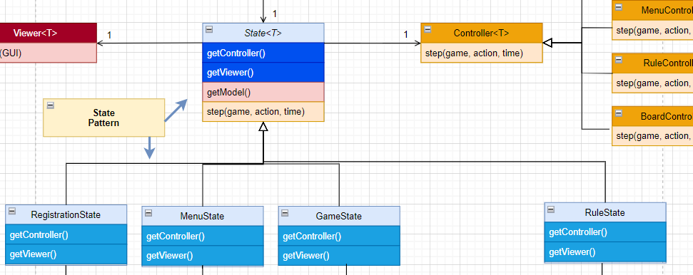
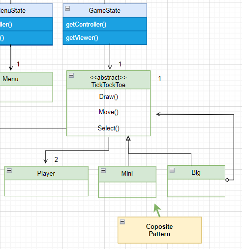
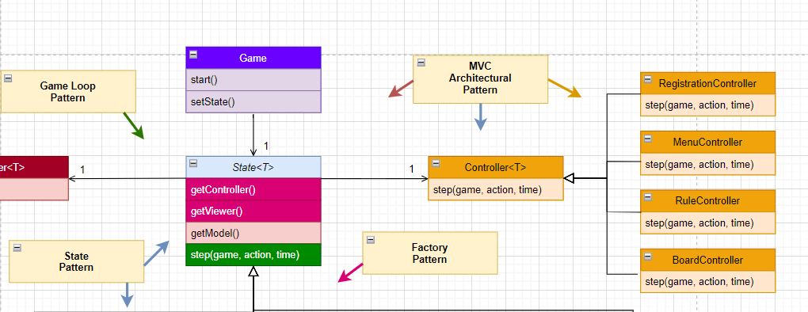
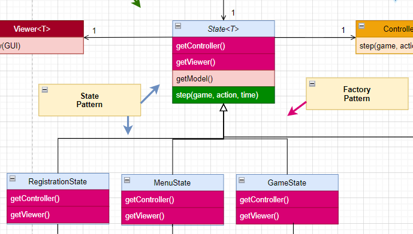

## LDTS_1203 - Tick Tock Toe
In this 2 player game we have a tic-tac-toe grid where each square has inside it a traditional game of tic-tac-toe.
At first a player chooses in which smaller tic-tac-toe square it wants to play, after that,the next player
is forced to play on the smaller game whose position on the bigger grid corresponds to the one played by the last player,
this means that if a player places its symbol on the middle square of a small tic-tac-toe then the next player
has to place his on any square from the small tick-tac-toe that it's placed at the center of the bigger grid,
when a small tic-tac-toe ends then that square in the bigger grid is considered won by the victorious symbol or as none if the smaller game ended in a tie.

The game is over when one player has won 3 smaller games in adjacent positions (identically to a tradition game of tick-tac-to)
or when there aren't any more spaces to be filled.

After the game ends the players scores are updated accordingly to the result, it is shown how much time tha game lasted and the time of the shortest game,
players also have the choice to keep playing in which case the game restarts. 

<<<<<<< HEAD
This project was developed by Amanda Tartarotti (202211647@up.pt) Gonçalo Sousa (202207320@up.pt) and Pedro Oliveira (up202206498@up.pt) for LDTS 2023⁄24.
=======
This project was developed by Amanda Tartarotti (up202211647@up.pt) Gonçalo Sousa (up202207320@up.pt) and Pedro Oliveira (up202206498@up.pt) for LDTS 2023⁄24.
>>>>>>> ResolvinComposition

### IMPLEMENTED FEATURES

- **Menu** - The game provides a menu capable of starting the game, showing the rules or exiting the program.
- **Rules** - Shows on the screen a text describing the rules of the game.
- **Symbol Assigment** - Allows player 1 to decide if it wants to have the crosses or circles symbol.
- **Time** - Shows the players a clock with duration of the game and their best time.
- **Coin Toss** - the first player that gets to place its symbol is decided randomly.

### PLANNED FEATURES

- **Move** - A player can change the selected square either on the bigger grid or a smaller one when appropriate.
- **Select** - A player can choose to play its symbol on the square that it has selected.
- **Score** - Each player has a score that starts at 0 and is incremented by 1 if they win the bigger tic-tac-toe game.
- **Time Statistics** - When the game ends it is shown the time it took and what percentage each player took with its plays.
- **Continue** - After the game the players can choose to continue playing and keep their scores.

### DESIGN

##### THE GAME NEEDS TO WRITE ON THE SCREEN, KEEP DATA AND TAKE USER INPUT

**Problem in Context**

By its very nature our game needs to show itself to the user through the screen, take user inputs and also act accordingly to said input,
while it is perfectly possible to have a single class that does this three functions said class would violate the **Single Responsibility Principle**

**The Pattern**

In order to solve this problem we have used the MVC Architectural Pattern, dividing our program into models that keep the program data,
viewers that draw on the screen and controllers that takes user inputs and uses its respective modules and viewers accordingly.

**Implementation**

The following figure shows how the pattern’s roles were mapped.

These classes can be found in the following folders:

<<<<<<< HEAD
-UML
- [TickTockToe](https://drive.google.com/file/d/1AbH7X8FMZkZQTS1Rr7Vgw2EX7A-ipMdt/view?usp=sharing)
=======
- [Models](src/main/java/project/model)
- [Viewers](src/main/java/project/viewer)
- [Generic Controller](src/main/java/project/controller)
>>>>>>> ResolvinComposition

**Consequences**

The use of the MVC Architectural Pattern in the current design allows the following benefits:
- Code readability, allowing any developer to know without doubt if the code of a class is related to data keeping, user input and visual feedback
- Respecting the **Single Responsibility Principle** by only attributing one function to a class.
- It improves scalability by simplifying the process of altering how the programme keeps data, reads input or gives visual feedback without altering other code sections.

##### THE GAME SHOULD SHOW DIFFERENT THINGS DEPENDING ON ITS STATE 

**Problem in Context**

The game should always start on the main menu however it should also be able to present the game rules as well as play the game itself,
while this could be accomplished with a variable 'state' and a conditional logic doing so would violate the **Single Responsibility Principle**
as well as the **Opened/Closed** principle since adding or removing states to our game would necessitate rewriting our code. 

**The Pattern**

We have applied the **State** pattern. This pattern allows us to represent different game states as different subclasses 
of a main class 'State', attributing said State to our class 'Game' and switching to another subclass when changing states.

**Implementation**

The following figure shows how the pattern’s roles were mapped.

These classes can be found in the following files:

<<<<<<< HEAD

- [TickTockToe](https://drive.google.com/file/d/1AbH7X8FMZkZQTS1Rr7Vgw2EX7A-ipMdt/view?usp=sharing)
=======
- [Game](src/main/java/project/Game.java)
- [Generic State](src/main/java/project/states/State.java)
- [Game State](src/main/java/project/states/GameState.java)
- [Menu State](src/main/java/project/states/MenuState.java)
- [Registration State](src/main/java/project/states/RegistrationState.java)
- [Rules State](src/main/java/project/states/RulesState.java)
>>>>>>> ResolvinComposition

**Consequences**

The use of the State Pattern in the current design allows the following benefits:

- All possible states of our game are represented in a more observable way (each has its class).
- We avoided the need for a 'while' and 'switch case' in our code for class Game
- We can now change more easily add or remove states to our game.
- There are now more classes and instances to manage, but still in a reasonable number.

##### THE GAME MUST DIFFERENTIATE PLAYING ON A SMALLER OR THE LARGER TIC TACT TOE GAME

**Problem in Context**

The initial idea was to have two different states 'BigGameState' and 'MiniGameState' that would be used to distinguish when the player is
making modifications to the bigger and smaller tic-tac-toe game, however this two states would be almost identical since the stages of playing a 
game of either side are essentially the same.

This would leave us with two very similar classes which is considered malpractice in OOP

**The Pattern**

The pattern chosen to resolve this issue was the Composite pattern that defines an abstract class and defines at least 2 subclasses, one being
a regular subclass and the other being a composition of the regular one, this allows us to represent the part-whole relation
between the bigger and smaller games

**Implementation**

The following figure shows how the pattern’s roles were mapped.

These classes can be found in the following files:

<<<<<<< HEAD
- [TickTockToe](https://drive.google.com/file/d/1AbH7X8FMZkZQTS1Rr7Vgw2EX7A-ipMdt/view?usp=sharing)
=======
- [Generic TicTacToe](src/main/java/project/model/board/TicTacToe.java)
- [Big TicTacToe](src/main/java/project/model/board/Big.java)
- [Mini TicTacToe](src/main/java/project/model/board/Mini.java)
>>>>>>> ResolvinComposition

**Consequences**

- The use of the Composite Pattern allows for an easier way to represent and manipulate the code.

##### THE GAME MUST KEEP RECEIVING USER INPUTS AND ACT ACCORDINGLY WHILE IT IS RUNNING

**Problem in Context**

The programme must know when to wait for players input as well as how to respond to such input.

**The Pattern**

The Pattern chosen to solve this problem was the Game Loop Pattern that consists of a loop that will run for all the games runtime
having an iteration per user input and reacting accordingly.

**Implementation**

The following figure shows how the pattern’s roles were mapped.

These classes can be found in the following files:

<<<<<<< HEAD
- [TickTockToe](https://drive.google.com/file/d/1AbH7X8FMZkZQTS1Rr7Vgw2EX7A-ipMdt/view?usp=sharing)
=======
- [State](src/main/java/project/states/State.java)
- [Registration step](src/main/java/project/controller/RegistrationController.java)
- [Menu step](src/main/java/project/controller/MenuController.java)
- [Rules step](src/main/java/project/controller/RuleController.java)
- [Board step](src/main/java/project/controller/BoardController.java)
>>>>>>> ResolvinComposition

**Consequences**

- The pattern allows us to control the frame rate of the game which results in a smother experience.
- The pattern also allows us to control the game flow in a simple and more precise way.

##### DIFFERENT STATES WILL HAVE CONTROLLERS AND VIEWERS OF DIFFERENT CLASSES 

**Problem in Context**

Each state must have a function to access its controller and viewer, but for different stages
the viewer and controller will be of different classes.

**The Pattern**

The pattern chosen to solve this problem was the Factory Method Pattern, which defines an interface for creating elements
but lets the subclasses chose what classes to instantiate.

**Implementation**

The following figure shows how the pattern’s roles were mapped.

These classes can be found in the following files:

- [TickTockToe UML](https://drive.google.com/file/d/1AbH7X8FMZkZQTS1Rr7Vgw2EX7A-ipMdt/view?usp=sharing)
- [State](src/main/java/project/states/State.java)
- [Registration step](src/main/java/project/controller/RegistrationController.java)
- [Menu step](src/main/java/project/controller/MenuController.java)
- [Rules step](src/main/java/project/controller/RuleController.java)
- [Board step](src/main/java/project/controller/BoardController.java)

**Consequences**

The use of the State Pattern in the current design allows the following benefits:
- The chosen pattern allows us to apply a dependency injection between a state, its controller and its viewer
by forcing it to only deal with the interface which simplifies feature implementation in our programme. 
- There are now more classes and instances to manage, but still in a reasonable number.

### KNOWN CODE SMELLS

- The way we implemented the drawing of a big and small tick-tack-toe grid requires us to draw it all white and 
after that draw on the same position again with a different color that symbolizes the square a player choose, resulting in an
repeated use of drawText function. 

### TESTING

### SELF-EVALUATION

-Amanda:34%

-Gonçalo:33%

-Pedro:33%